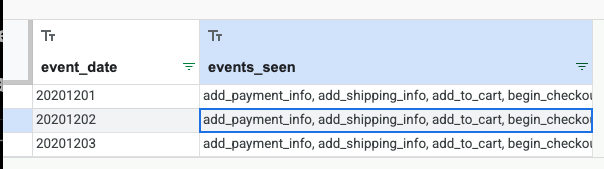
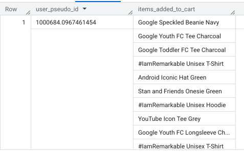
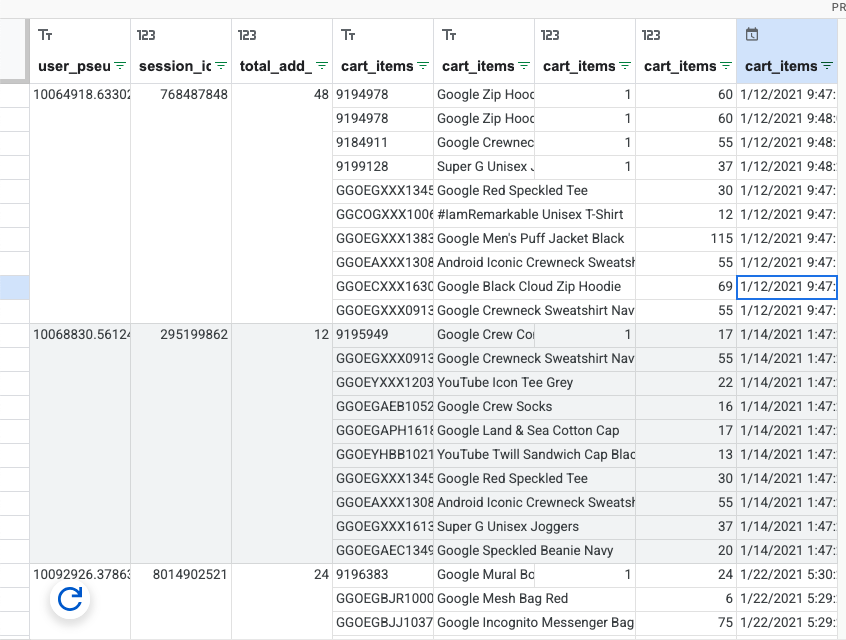
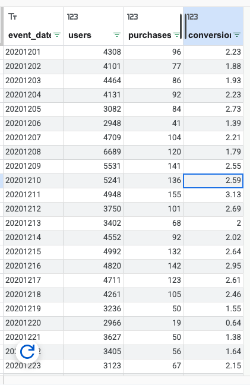
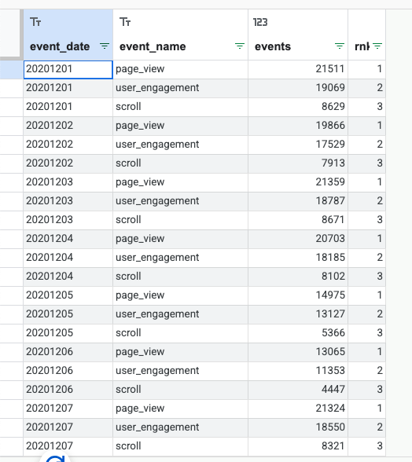
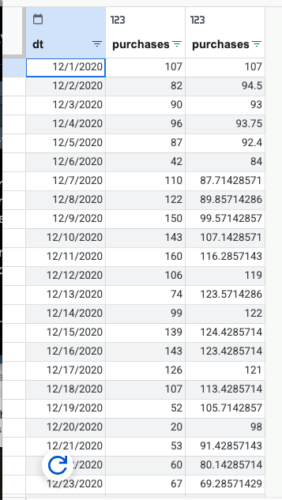
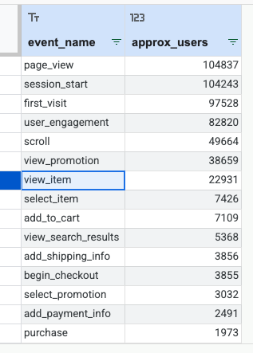

# Published Version (GitHub Pages)

[View the published HTML on GitHub Pages](https://kathleen-juarez.github.io/IC-CP-W05-BigQuery-SQL-Lecture-2/Juarez_IC-CP-W05-BigQuery-SQL-Lecture%202.html)

# 1. CTEs (WITH) to structure logic

``` sql
# Lecture 2.1 — CTEs (WITH): Total users + new users
WITH UserInfo AS (
  SELECT
    user_pseudo_id,
    MAX(IF(event_name IN ('first_visit', 'first_open'), 1, 0)) AS is_new_user
  FROM `bigquery-public-data.ga4_obfuscated_sample_ecommerce.events_*`
  WHERE _TABLE_SUFFIX BETWEEN '20201101' AND '20201130'
  GROUP BY user_pseudo_id
)
SELECT
  COUNT(*) AS total_users,
  SUM(is_new_user) AS new_users
FROM UserInfo;
```


### Explanation: 

### This query creates a temporary table to flag whether each user is new. It then counts total users and how many of them are new during the selected date range.

# 2. Arrays + UNNEST

## Pattern A — Scalar subquery extraction (simple, safe)

``` sql
# Extract page_location from event_params
SELECT
  TIMESTAMP_MICROS(event_timestamp) AS event_time,
  (
    SELECT value.string_value
    FROM UNNEST(event_params)
    WHERE key = 'page_location'
    LIMIT 1
  ) AS page_location
FROM `bigquery-public-data.ga4_obfuscated_sample_ecommerce.events_*`
WHERE event_name = 'page_view'
  AND _TABLE_SUFFIX BETWEEN '20201201' AND '20201202'
LIMIT 50;
```


### Explanation:

This query pulls the page URL from the `event_params` array for each page view. It shows when the event happened and which page was viewed.

### Pattern B — Flattening (UNNEST in FROM) for item-level analysis

This *multiplies rows* (one event can have many items)

``` sql
# Lecture 2.2B — UNNEST(items) to analyze item-level purchase activity
SELECT
  event_date,
  item.item_name,
  COUNT(*) AS item_rows
FROM `bigquery-public-data.ga4_obfuscated_sample_ecommerce.events_*` e,
UNNEST(e.items) AS item
WHERE e.event_name = 'purchase'
  AND _TABLE_SUFFIX BETWEEN '20201201' AND '20201231'
GROUP BY event_date, item.item_name
ORDER BY item_rows DESC
LIMIT 20;
```


### Explanation:

This query flattens the items array so each purchased product becomes its own row. It then counts how many times each item appears

# 3. STRING_AGG, ARRAY_AGG (useful aggregations)

**What they do:** combine many values into one row per group.

## Example: Build a “session cart summary” (top items a user added to cart)

``` sql
# STRING_AGG: list event types seen per day
SELECT
  event_date,
  STRING_AGG(DISTINCT event_name, ', ' ORDER BY event_name) AS events_seen
FROM `bigquery-public-data.ga4_obfuscated_sample_ecommerce.events_*`
WHERE _TABLE_SUFFIX BETWEEN '20201201' AND '20201203'
GROUP BY event_date
ORDER BY event_date;
```



### Explanation:

This query lists all unique event types that happened on each day. It combines them into one comma-separated string per date.

## Use Case 1

``` sql
# ARRAY_AGG: items added to cart per user (list)
SELECT
  user_pseudo_id,
  ARRAY_AGG(item.item_name) AS items_added_to_cart
FROM `bigquery-public-data.ga4_obfuscated_sample_ecommerce.events_*`,
UNNEST(items) AS item
WHERE event_name = 'add_to_cart'
  AND _TABLE_SUFFIX BETWEEN '20201201' AND '20201231'
GROUP BY user_pseudo_id
ORDER BY user_pseudo_id
LIMIT 10;
```



### Explanation: 

This query creates a list of products each user added to their cart. Each row represents one user and the items they added.

## Use Case 2

``` sql
# Session-level cart summary using ARRAY_AGG + STRUCT
WITH add_to_cart AS (
  SELECT
    user_pseudo_id,
    (
      SELECT value.int_value
      FROM UNNEST(event_params)
      WHERE key = 'ga_session_id'
      LIMIT 1
    ) AS session_id,
    TIMESTAMP_MICROS(event_timestamp) AS event_ts,
    i.item_id,
    i.item_name,
    i.quantity,
    i.price
  FROM `bigquery-public-data.ga4_obfuscated_sample_ecommerce.events_*`,
  UNNEST(items) AS i
  WHERE event_name = 'add_to_cart'
    AND _TABLE_SUFFIX BETWEEN '20210101' AND '20211231'
)
SELECT
  user_pseudo_id,
  session_id,
  COUNT(*) AS total_add_to_cart_item_rows,
  ARRAY_AGG(
    STRUCT(item_id, item_name, quantity, price, event_ts)
    ORDER BY quantity DESC, event_ts ASC
    LIMIT 10
  ) AS cart_items
FROM add_to_cart
WHERE session_id IS NOT NULL
GROUP BY user_pseudo_id, session_id
ORDER BY user_pseudo_id, session_id;
```



### Explanation:

This query groups add-to-cart activity by user and session. It builds a structured list of the items added in each session, including quantity and price.

# 4. Joins (start with INNER and LEFT)

**What it does:** combines results based on matching keys.

``` sql
WITH daily_users AS (
  SELECT
    event_date,
    COUNT(DISTINCT user_pseudo_id) AS users
  FROM `bigquery-public-data.ga4_obfuscated_sample_ecommerce.events_*`
  WHERE _TABLE_SUFFIX BETWEEN '20201201' AND '20201231'
  GROUP BY event_date
),
daily_purchases AS (
  SELECT
    event_date,
    COUNT(DISTINCT (
      SELECT value.string_value
      FROM UNNEST(event_params)
      WHERE key = 'transaction_id'
      LIMIT 1
    )) AS purchases
  FROM `bigquery-public-data.ga4_obfuscated_sample_ecommerce.events_*`
  WHERE event_name = 'purchase'
    AND _TABLE_SUFFIX BETWEEN '20201201' AND '20201231'
  GROUP BY event_date
)
SELECT
  u.event_date,
  u.users,
  IFNULL(p.purchases, 0) AS purchases,
  ROUND(IFNULL(p.purchases, 0) / NULLIF(u.users, 0) * 100, 2) AS conversion_rate_pct
FROM daily_users u
LEFT JOIN daily_purchases p
  ON u.event_date = p.event_date
ORDER BY u.event_date;
```



### Explanation:

This query joins daily user counts with daily purchase counts. It also calculates a daily conversion rate by dividing purchases by users.

# 5. Window functions + QUALIFY

**What they do:** calculate “across rows” without collapsing to one row per group.

### Top 3 event types per day (RANK) + QUALIFY

``` sql
# Window + QUALIFY: top 3 event types per day
WITH daily_event_counts AS (
  SELECT
    event_date,
    event_name,
    COUNT(*) AS events
  FROM `bigquery-public-data.ga4_obfuscated_sample_ecommerce.events_*`
  WHERE _TABLE_SUFFIX BETWEEN '20201201' AND '20201207'
  GROUP BY event_date, event_name
)
SELECT
  event_date,
  event_name,
  events,
  RANK() OVER (PARTITION BY event_date ORDER BY events DESC) AS rnk
FROM daily_event_counts
QUALIFY rnk <= 3
ORDER BY event_date, rnk;
```



### Explanation:

This query ranks event types by how often they occurred each day. It then keeps only the top three events per day.

### Rolling 7-day average of daily purchases

``` sql
# Rolling 7-day average purchases
WITH daily_purchases AS (
  SELECT
    PARSE_DATE('%Y%m%d', event_date) AS dt,
    COUNT(*) AS purchases
  FROM `bigquery-public-data.ga4_obfuscated_sample_ecommerce.events_*`
  WHERE event_name = 'purchase'
    AND _TABLE_SUFFIX BETWEEN '20201201' AND '20201231'
  GROUP BY dt
)
SELECT
  dt,
  purchases,
  AVG(purchases) OVER (
    ORDER BY dt
    ROWS BETWEEN 6 PRECEDING AND CURRENT ROW
  ) AS purchases_7d_avg
FROM daily_purchases
ORDER BY dt;
```



### Explanation:

This query calculates daily purchase counts and then computes a rolling 7-day average. It smooths out daily fluctuations to show trends.

# 6. Approximate functions (performance-minded)

**What they do:** return “close enough” answers faster on huge datasets.

### Approx distinct users per event type

``` sql
# APPROX_COUNT_DISTINCT: fast approx distinct users
SELECT
  event_name,
  APPROX_COUNT_DISTINCT(user_pseudo_id) AS approx_users
FROM `bigquery-public-data.ga4_obfuscated_sample_ecommerce.events_*`
WHERE _TABLE_SUFFIX BETWEEN '20201201' AND '20201231'
GROUP BY event_name
ORDER BY approx_users DESC
LIMIT 15;
```



### Explanation:

This query estimates how many unique users triggered each event type. It uses an approximate function to run faster on large datasets.
