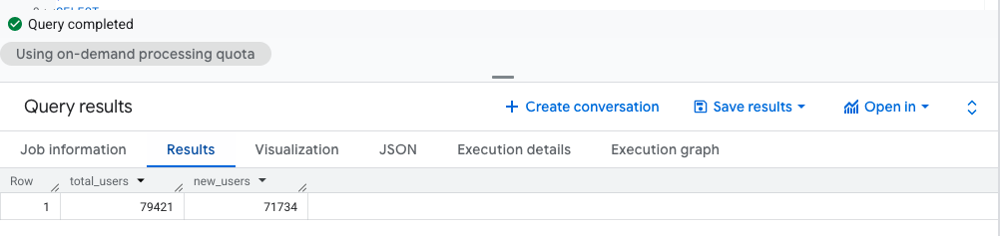
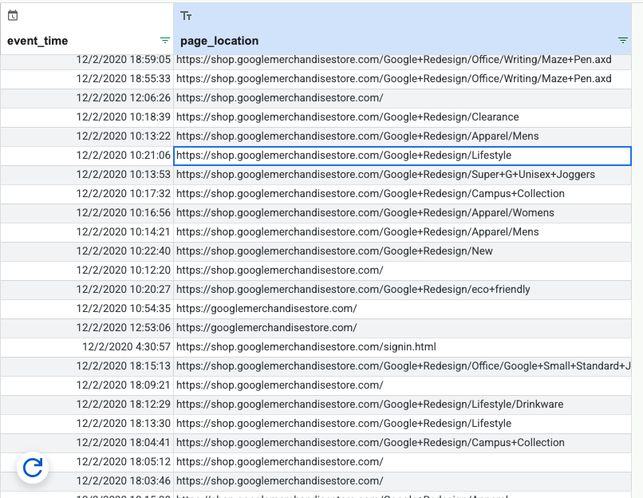
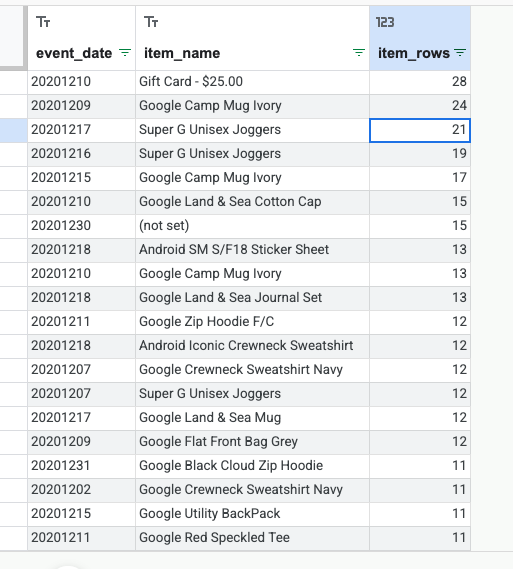

# 1. CTEs (WITH) to structure logic

``` sql
# Lecture 2.1 — CTEs (WITH): Total users + new users
WITH UserInfo AS (
  SELECT
    user_pseudo_id,
    MAX(IF(event_name IN ('first_visit', 'first_open'), 1, 0)) AS is_new_user
  FROM `bigquery-public-data.ga4_obfuscated_sample_ecommerce.events_*`
  WHERE _TABLE_SUFFIX BETWEEN '20201101' AND '20201130'
  GROUP BY user_pseudo_id
)
SELECT
  COUNT(*) AS total_users,
  SUM(is_new_user) AS new_users
FROM UserInfo;
```



# 2. Arrays + UNNEST

## Pattern A — Scalar subquery extraction (simple, safe)

``` sql
# Extract page_location from event_params
SELECT
  TIMESTAMP_MICROS(event_timestamp) AS event_time,
  (
    SELECT value.string_value
    FROM UNNEST(event_params)
    WHERE key = 'page_location'
    LIMIT 1
  ) AS page_location
FROM `bigquery-public-data.ga4_obfuscated_sample_ecommerce.events_*`
WHERE event_name = 'page_view'
  AND _TABLE_SUFFIX BETWEEN '20201201' AND '20201202'
LIMIT 50;
```



### Pattern B — Flattening (UNNEST in FROM) for item-level analysis

This *multiplies rows* (one event can have many items)

``` sql
# Lecture 2.2B — UNNEST(items) to analyze item-level purchase activity
SELECT
  event_date,
  item.item_name,
  COUNT(*) AS item_rows
FROM `bigquery-public-data.ga4_obfuscated_sample_ecommerce.events_*` e,
UNNEST(e.items) AS item
WHERE e.event_name = 'purchase'
  AND _TABLE_SUFFIX BETWEEN '20201201' AND '20201231'
GROUP BY event_date, item.item_name
ORDER BY item_rows DESC
LIMIT 20;
```



# 3. STRING_AGG, ARRAY_AGG (useful aggregations)

**What they do:** combine many values into one row per group.

### Example: Build a “session cart summary” (top items a user added to cart)

## Use Case 1

``` sql
```

## Use Case 2

# 4. Joins (start with INNER and LEFT)

**What it does:** combines results based on matching keys.

``` sql
```

# 5. Window functions + QUALIFY

**What they do:** calculate “across rows” without collapsing to one row per group.

### Top 3 event types per day (RANK) + QUALIFY

``` sql
```

### Rolling 7-day average of daily purchases

``` sql
```

# 6. Approximate functions (performance-minded)

**What they do:** return “close enough” answers faster on huge datasets.

### Approx distinct users per event type

``` sql
```
